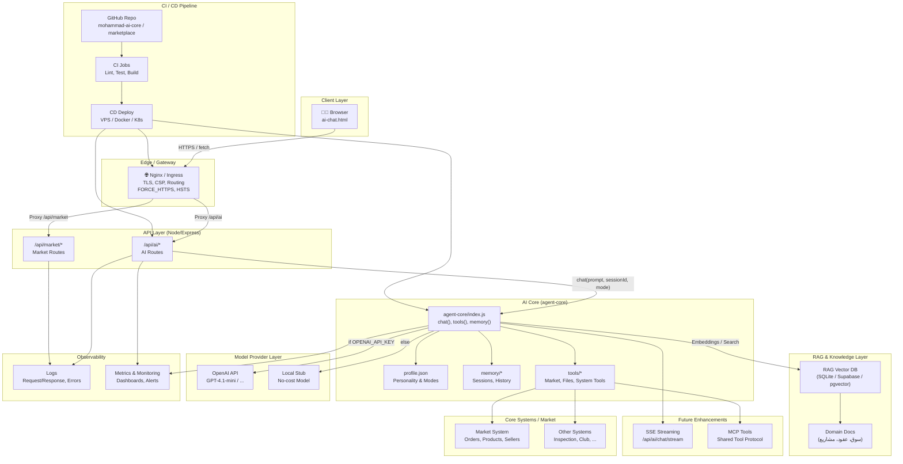

# 📘 دليل المعمارية الكاملة للوكيل الذكي المحمول (مستشار محمد)

AI Portable Agent – Architecture Guide

الإصدار: 2025-12-01

---

## المحتويات

1. [مقدمة](#مقدمة)
2. [الرحلة من السؤال إلى الإجابة](#الرحلة-من-السؤال-إلى-الإجابة)
3. [المكوّنات الأساسية للنظام](#المكوّنات-الأساسية-للنظام)
4. [هيكل الملفات والمجلدات](#هيكل-الملفات-والمجلدات)
5. [دورة حياة الطلب بالتفصيل](#دورة-حياة-الطلب-بالتفصيل)
6. [مصادر الإجابات](#مصادر-الإجابات)
7. [طبقة الذاكرة](#طبقة-الذاكرة)
8. [اختيار قاعدة البيانات](#اختيار-قاعدة-البيانات)
9. [هيكلية المعمارية (Mermaid)](#هيكلية-المعمارية)
10. [خطوات البناء من الصفر حتى التشغيل](#خطوات-البناء-من-الصفر-حتى-التشغيل)
11. [طبقة الأدوات (Tools – Market Integration)](#طبقة-الأدوات-tools--market-integration)
12. [المراقبة وSSE والنشر](#المراقبة-وsse-والنشر)
13. [ملخص نهائي](#ملخص-نهائي)

---

## مقدمة

الوكيل الذكي "مستشار محمد" هو نظام ذكاء صناعي محمول وقابل للنقل يعمل عبر المتصفح والسيرفر وCLI وVS Code.
المعماريّة نظيفة ومقسّمة: واجهة خفيفة، طبقة API، نواة ذكاء مستقلة (agent-core)، ذاكرة جلسات محمولة، ومزوّد نموذج قابل للاستبدال.

يهدف هذا الدليل إلى توثيق الرحلة الكاملة من تلقي السؤال وحتى إنتاج الإجابة، مع وصف الطبقات والملفات ومسارات النشر.

---

## الرحلة من السؤال إلى الإجابة

1) المستخدم يكتب رسالة داخل صفحة `pages/ai-chat.html`.
2) الواجهة ترسل الطلب إلى السيرفر عبر `POST /api/ai/chat` أو `POST /api/ai/chat/stream` (SSE).
3) راوتر `src/routes/ai.js` يمرّر الرسالة إلى نواة الذكاء `agent-core`.
4) النواة تقوم بـ:
   - تحميل الهوية من `agent-core/profile.json`.
   - استعادة تاريخ الجلسة من الذاكرة.
   - اختيار مزود النموذج (OpenAI أو Stub).
   - إرسال الطلب للموديل وجمع المخرجات بشكل مباشر أو متدفق.
5) يتم حفظ الإدخال/الإخراج في الذاكرة وإرجاع الإجابة.
6) الواجهة تعرض الرسالة بشكل Markdown مع إمكانيّة النسخ وإيقاف البث.

---

## المكوّنات الأساسية للنظام

### 1) واجهة المستخدم (UI)

| المسار | الوصف |
|---|---|
| `pages/ai-chat.html` | واجهة الدردشة مع دعم البث، الجلسات، النسخ، وضبط API Base يدويًا. |
| `pages/ai-chat-healthz.html` | صفحة صحة لفحص Ping وSSE من المتصفح. |

وظائف رئيسية:
- إرسال الطلبات إلى `/api/ai/chat` و`/api/ai/chat/stream`.
- عرض الرسائل مع Markdown، زر نسخ، وإيقاف البث.
- إدارة الجلسات (إنشاء/تفعيل/حذف/تصدير). 

### 2) طبقة السيرفر (Server/API)

| المسار | الوصف |
|---|---|
| `server.js` | نقطة تشغيل Express؛ يقدم `/pages` ثابتة ليوحّد الأصل ويثبت CORS. |
| `src/routes/ai.js` | راوتر `/api/ai/*` (chat JSON, chat/stream SSE, sessions, tools/call). |

وظائف رئيسية:
- تمرير الطلبات إلى `agent-core`.
- ترويسات SSE صلبة: `no-cache, no-transform` و`X-Accel-Buffering: no`.
- مقاييس (Prometheus) وتسجيل تدقيق (Audit).

### 3) نواة الذكاء (agent-core)

| الملف/المجلد | الوصف |
|---|---|
| `agent-core/index.js` | الدوال `chat()` و`stream()` + إدارة الذاكرة والجلسات. |
| `agent-core/profile.json` | هوية المساعد والسياسات والمودات. |
| `agent-core/memory/sessions/*.jsonl` | تاريخ الجلسات بصيغة JSONL. |
| `agent-core/tools/` | طبقة الأدوات (echo, math وأدوات السوق لاحقًا). |

### 4) مزود النموذج

| المزود | متى يُستخدم | الوصف |
|---|---|---|
| Stub | غياب `OPENAI_API_KEY` | ردود تجريبية بدون تكلفة. |
| OpenAI | وجود المفتاح | ردود فعلية من GPT وفق الموديل المحدد. |

---

## هيكل الملفات والمجلدات

```text
systems/marketplace/
  server.js
  src/
    routes/
      ai.js
  pages/
    ai-chat.html
    ai-chat-healthz.html
  agent-core/
    index.js
    profile.json
    memory/
      sessions/
        <session>.jsonl
    tools/
      index.js
```

> ملاحظة: قد تختلف التفاصيل قليلًا حسب تطوّر المستودع، لكن الترتيب المنطقي كما أعلاه.

---

## دورة حياة الطلب بالتفصيل

### 1) من الواجهة

```javascript
fetch('/api/ai/chat', {
  method: 'POST',
  headers: { 'Content-Type': 'application/json' },
  body: JSON.stringify({ prompt: userText, sessionId: 'mohammad-main', mode: 'personal' })
});
```

### 2) في راوتر `/api/ai/chat`

```javascript
const core = require('../../agent-core');
const result = await core.chat({ prompt, sessionId, mode, history });
res.json({ ok: true, reply: result.reply, model: result.model });
```

### 3) في `agent-core/chat()`

- تحميل `profile.json`.
- جلب التاريخ (memory Store).
- اختيار المزود (OpenAI/Stub) وفق البيئة.
- إرسال الرسائل للموديل.
- حفظ الإدخال/الإخراج في ذاكرة الجلسة.
- إرجاع النتيجة مع `usage` و`latency` إن توفرت.

---

## مصادر الإجابات

1) المزود (OpenAI أو Stub): المصدر الأساسي الحالي.
2) ملف الشخصية `profile.json`: يضبط النبرة والسياسات.
3) الذاكرة (history): سياق من الجلسة الماضية.
4) مستقبلًا: طبقة RAG لمدّ الإجابات بمقاطع من وثائق المجال.

---

## طبقة الذاكرة

- المسار: `agent-core/memory/sessions/`.
- الصيغة: JSONL (سطر لكل رسالة).

مثال:
```json
{"role":"user","content":"مرحبا"}
{"role":"assistant","content":"أهلا محمد"}
```

ميزات:
- محمولة وقابلة للأرشفة.
- قابلة للاستبدال بباكند SQLite/pg لاحقًا.

---

## اختيار قاعدة البيانات

| المرحلة | التخزين | الاستخدام |
|---|---|---|
| 1 | JSONL | تطوير وتجريب سريع |
| 2 | SQLite | وكيل محمول قوي ومبسّط |
| 3 | PostgreSQL/pgvector | إنتاج مع RAG وتعدد خدمات |

---

## هيكلية المعمارية

يمكن تضمين هذا المخطط (Mermaid) مباشرة داخل هذا الملف ليعرض رسماً بيانياً في منصات تدعم Mermaid:



---

## خطوات البناء من الصفر حتى التشغيل

### 1) تثبيت الاعتمادات

```powershell
npm install
```

### 2) إعداد البيئة (اختياري)

ملف `.env` أو متغيرات البيئة:

```bash
# تشغيل بلا Mongo (وضع ذاكرة)
MARKET_ALLOW_DB_FAIL=1
AI_MODEL=gpt-4.1-mini
AI_PROFILE_PATH=./agent-core/profile.json
AI_MEMORY_DIR=./agent-core/memory

# مزود OpenAI (اختياري)
# OPENAI_API_KEY=sk-...
```

### 3) تشغيل محلي (ذاكرة) على 5500

```powershell
npm run dev:5500
# ثم افتح:
# http://localhost:5500/pages/ai-chat-healthz.html
# http://localhost:5500/pages/ai-chat.html
```

### 4) تشغيل مع Mongo Atlas بأمان

```powershell
$env:MARKET_MONGO_URL = "mongodb+srv://<user>:<pass>@<cluster>/?retryWrites=true&w=majority"
npm run dev:5500
```
> لا تضع بيانات الدخول داخل المستودع. استخدم متغيرات البيئة أو أسرار CI/CD.

### 5) اختبار SSE تلقائيًا (اختياري)

```powershell
npm run ci:sse
```

---

## طبقة الأدوات (Tools – Market Integration)

طبقة أدوات قابلة للتوسعة (MCP-ready) تُمكّن الوكيل من أداء مهام واقعية عبر واجهات أنظمة السوق:

أمثلة على الأدوات المقترحة:
- البحث عن منتجات، قراءة بيانات بائع، تحليل أسعار، إنشاء طلبات.
- أدوات الملفات لقراءة مستندات المشاريع.

مبدأ العمل:
- كل أداة Adapter مستقل (Input → Validate → Call System → Normalize Output).
- الأدوات تُستدعى من `agent-core/tools` بحسب الاسم والمعاملات.

---

## المراقبة وSSE والنشر

- المقاييس (Prometheus): عدد الطلبات، الأخطاء، زمن الاستجابة، استخدام Tokens.
- الترويسات الداعمة للبث عبر بروكسي:
  - `Cache-Control: no-cache, no-transform`
  - `X-Accel-Buffering: no`
- نشر خلف Nginx/Ingress:
  - راجع `infra/nginx/example.conf` و`infra/k8s/ingress.yaml` في المستودع.
- الصفحات الثابتة (`/pages`) تُقدّم من نفس الخادم لتوحيد الأصل ومنع CORS.

---

## ملخص نهائي

- وكيل ذكاء محمول/مستقل، قابل للتشغيل في متصفح/سيرفر/CLI، بهوية وسياسات واضحة.
- نواة ذكاء (agent-core) تفصل المنطق عن الواجهة والمزوّد، وتُسهّل تبديل الأدوات والذاكرة.
- بث SSE، صفحات صحّة، ومكوّنات مراقبة جاهزة للإنتاج.
- نشر مبسّط عبر خادم واحد أو خلف Nginx/Ingress مع إعدادات SSE آمنة.

> الاقتراحات المستقبلية: إضافة طبقة RAG متجهية (pgvector/Supabase)، باكند ذاكرة SQLite، وتوسعة أدوات السوق وفق احتياجات العمل.

***

تم إعداد هذا الدليل ليكون مرجعًا واحدًا متكاملاً يمكن استخدامه داخل المستودع في `docs/AI_ARCHITECTURE_GUIDE.md`، ويمكن لاحقًا توليد نسخة PDF ونسخة إنجليزية منه بسهولة.