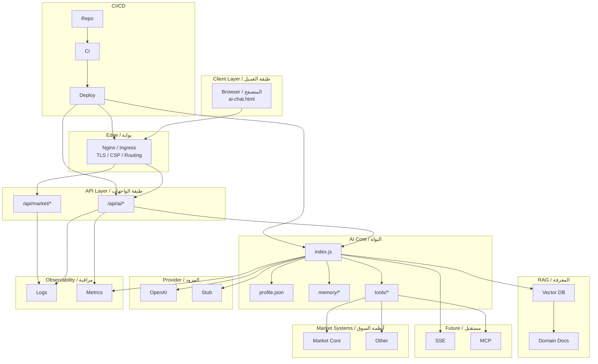

# 🌐 Portable AI Agent Architecture Guide / دليل المعمارية للوكيل الذكي المحمول

Edition / الإصدار: 2025-12-01

---

## Table of Contents / المحتويات

1. Introduction / مقدمة
2. From Question to Answer / الرحلة من السؤال إلى الإجابة
3. Core Components / المكوّنات الأساسية
4. Files Layout / هيكل الملفات
5. Request Lifecycle / دورة حياة الطلب
6. Answer Sources / مصادر الإجابات
7. Memory Layer / طبقة الذاكرة
8. Database Choices / اختيار قاعدة البيانات
9. Architecture (Mermaid) / هيكلية (Mermaid)
10. Build & Run Steps / خطوات البناء والتشغيل
11. Tools Layer / طبقة الأدوات
12. Observability & SSE & Deployment / المراقبة والبث والنشر
13. Final Summary / ملخص نهائي

---

## 1. Introduction / مقدمة

EN: “Mohammad Advisor” is a portable AI agent: browser, server, CLI, VS Code. Clean layering (UI → API → Core → Memory → Provider) enables swap & scale.

AR: "مستشار محمد" وكيل ذكاء صناعي محمول يعمل عبر المتصفح والسيرفر وCLI و VS Code بمعمارية نظيفة ومقسّمة تسمح بالتوسع والتبديل.

---

## 2. From Question to Answer / الرحلة من السؤال إلى الإجابة

EN:
1. User types in `ai-chat.html`.
2. POST `/api/ai/chat` or `/api/ai/chat/stream`.
3. Router forwards to core.
4. Core loads profile, memory, selects provider, queries model.
5. Saves I/O, returns answer.
6. UI renders Markdown (stream or full).

AR:
1) المستخدم يكتب في `pages/ai-chat.html`.
2) إرسال إلى `POST /api/ai/chat` أو البث.
3) الراوتر يمرر إلى النواة.
4) النواة تقرأ الهوية + الذاكرة وتختار المزود.
5) حفظ الإدخال/الإخراج وإرجاع الرد.
6) الواجهة تعرض الرسالة.

---

## 3. Core Components / المكوّنات الأساسية

EN UI: `ai-chat.html` (chat, sessions, manual base), `ai-chat-healthz.html` (ping/SSE test).
AR الواجهة: صفحة المحادثة + صفحة الصحة.

EN Server: `server.js` (Express entry, serves /pages), `src/routes/ai.js` (chat, stream, sessions, tools).
AR السيرفر: تشغيل Express وتوجيه مسارات الذكاء.

EN Core: `agent-core/index.js`, `profile.json`, `memory/sessions/*.jsonl`, `tools/`.
AR النواة: المنطق، الشخصية، الذاكرة، الأدوات.

EN Providers: Stub (no key), OpenAI (with key).
AR المزود: بديل مجاني / مزود حقيقي.

---

## 4. Files Layout / هيكل الملفات

```text
pages/ai-chat.html
pages/ai-chat-healthz.html
agent-core/index.js
agent-core/profile.json
agent-core/memory/sessions/*.jsonl
agent-core/tools/
src/routes/ai.js
server.js
```

---

## 5. Request Lifecycle / دورة حياة الطلب

Code:
```javascript
fetch('/api/ai/chat', {
  method: 'POST',
  headers: { 'Content-Type': 'application/json' },
  body: JSON.stringify({ prompt, sessionId: 'main', mode: 'personal' })
});
```

Core Steps (EN/AR): load profile / تحميل الهوية; fetch memory / استرجاع الذاكرة; choose provider / اختيار المزود; send & persist / إرسال وحفظ.

---

## 6. Answer Sources / مصادر الإجابات

EN: Model provider, profile, session memory, future RAG.
AR: المزود، ملف الشخصية، الذاكرة، طبقة معرفة مستقبلية.

---

## 7. Memory Layer / طبقة الذاكرة

Path: `agent-core/memory/sessions/` JSONL lines.

Example / مثال:
```json
{"role":"user","content":"Hello"}
{"role":"assistant","content":"Hi Mohammad"}
```

EN: Portable, easy to archive.
AR: محمولة وسهلة الأرشفة.

---

## 8. Database Choices / اختيار قاعدة البيانات

| Phase | EN Storage | AR التخزين | Usage / الاستخدام |
|-------|------------|------------|-------------------|
| 1 | JSONL | JSONL | Dev & test / تطوير وتجربة |
| 2 | SQLite | SQLite | Portable strength / وكيل محمول قوي |
| 3 | PostgreSQL + pgvector | PostgreSQL + pgvector | Production & RAG / إنتاج + RAG |

---

## 9. Architecture (Mermaid) / هيكلية (Mermaid)



---

## 10. Build & Run Steps / خطوات البناء والتشغيل

```powershell
npm install
npm run dev:5500
# Open / افتح:
# http://localhost:5500/pages/ai-chat.html
```

Mongo (EN): set `MARKET_MONGO_URL` env var.
Mongo (AR): ضع المتغير `MARKET_MONGO_URL` في البيئة.

SSE Smoke:
```powershell
npm run ci:sse
```

Docs build:
```powershell
npm run docs:build
npm run docs:pdf:bi
```

---

## 11. Tools Layer / طبقة الأدوات

EN: Adapters to query market data, analyze prices, create orders, read project files.
AR: محولات للوصول لبيانات السوق وتحليل الأسعار وإنشاء الطلبات وقراءة ملفات المشاريع.

Flow: Input → Validate → Call System → Normalize → Return.

---

## 12. Observability & SSE & Deployment / المراقبة والبث والنشر

EN: Prometheus metrics, audit logs, hardened SSE headers (`no-transform`, disable buffering), Nginx/Ingress templates.
AR: مقاييس Prometheus وسجلات تدقيق وترويسات SSE محمية وقوالب Nginx/Ingress.

Serve `/pages` same-origin to avoid CORS / تقديم الصفحات من نفس الأصل لتفادي مشاكل CORS.

---

## 13. Final Summary / ملخص نهائي

EN: Portable agent, layered, ready for RAG & tool expansion, bilingual docs & build scripts included.
AR: وكيل محمول متعدد الطبقات جاهز للتوسعة (RAG والأدوات) مع توثيق ثنائي اللغة وبناء تلقائي.

Next (EN): add SQLite backend, enrich tools with market analytics.
التالي (AR): إضافة باكند SQLite وتوسعة أدوات التحليل.

---

© 2025 Portable AI Agent Documentation
