# 📘 Portable AI Agent Architecture Guide (Mohammad Advisor)

Edition: 2025-12-01

---

## Table of Contents

1. Introduction
2. From Question to Answer
3. Core Components
4. Files and Folders Layout
5. Request Lifecycle (Detailed)
6. Answer Sources
7. Memory Layer
8. Database Choices
9. Architecture (Mermaid)
10. Build & Run Steps
11. Tools Layer (Market Integration)
12. Observability, SSE, and Deployment
13. Final Summary

---

## Introduction

“Mohammad Advisor” is a portable, self-contained AI agent that runs across Browser, Server, CLI, and VS Code. The architecture is clean and layered: a lightweight UI, an API layer, an independent agent-core, portable session memory, and a swappable model provider.

This guide documents the complete journey from receiving a user prompt to producing an answer, along with the layers, files, and deployment pathways.

---

## From Question to Answer

1) The user types a message in `pages/ai-chat.html`.
2) The UI posts to `POST /api/ai/chat` or streams via `POST /api/ai/chat/stream` (SSE).
3) The router `src/routes/ai.js` forwards the request to the agent core.
4) The agent core:
   - Loads personality from `agent-core/profile.json`.
   - Restores session history from memory.
   - Selects the model provider (OpenAI or Stub).
   - Sends the request to the model (direct or streaming).
5) Input/output is persisted in memory and the answer is returned.
6) The UI renders Markdown with copy and stop-stream controls.

---

## Core Components

### 1) UI

| Path | Description |
|---|---|
| `pages/ai-chat.html` | Full chat UI with streaming, sessions, copy, manual API base. |
| `pages/ai-chat-healthz.html` | Health page to test Ping and SSE in-browser. |

Key functions:
- Post to `/api/ai/chat` and `/api/ai/chat/stream`.
- Render messages (Markdown), copy, stop streaming.
- Manage sessions (create/select/delete/export).

### 2) Server/API Layer

| Path | Description |
|---|---|
| `server.js` | Express entry; serves `/pages` statically for same-origin runs. |
| `src/routes/ai.js` | `/api/ai/*` (chat JSON, chat/stream SSE, sessions, tools/call). |

Highlights:
- Forwards to `agent-core`.
- SSE headers: `no-cache, no-transform` and `X-Accel-Buffering: no`.
- Prometheus metrics and audit logging.

### 3) Agent Core

| File/Folder | Description |
|---|---|
| `agent-core/index.js` | `chat()`/`stream()` plus session/memory management. |
| `agent-core/profile.json` | Personality, modes, and policies. |
| `agent-core/memory/sessions/*.jsonl` | Session history in JSONL. |
| `agent-core/tools/` | Tools layer (echo, math, market tools later). |

### 4) Model Provider

| Provider | When | Description |
|---|---|---|
| Stub | No `OPENAI_API_KEY` | Cost-free development responses. |
| OpenAI | With API key | Real model responses (e.g., GPT-4.1-mini). |

---

## Files and Folders Layout

```text
systems/marketplace/
  server.js
  src/
    routes/
      ai.js
  pages/
    ai-chat.html
    ai-chat-healthz.html
  agent-core/
    index.js
    profile.json
    memory/
      sessions/
        <session>.jsonl
    tools/
      index.js
```

---

## Request Lifecycle (Detailed)

### 1) From the UI

```javascript
fetch('/api/ai/chat', {
  method: 'POST',
  headers: { 'Content-Type': 'application/json' },
  body: JSON.stringify({ prompt: userText, sessionId: 'mohammad-main', mode: 'personal' })
});
```

### 2) In `/api/ai/chat`

```javascript
const core = require('../../agent-core');
const result = await core.chat({ prompt, sessionId, mode, history });
res.json({ ok: true, reply: result.reply, model: result.model });
```

### 3) In `agent-core/chat()`

- Load `profile.json`.
- Fetch memory history.
- Choose provider based on env.
- Send messages to the model.
- Persist I/O in session memory.
- Return result with optional `usage` and `latency`.

---

## Answer Sources

1) Model provider (OpenAI or Stub).
2) Personality file `profile.json`.
3) Session memory (history).
4) Future: RAG layer to augment answers using domain docs.

---

## Memory Layer

- Path: `agent-core/memory/sessions/`.
- Format: JSONL (one message per line).

Example:
```json
{"role":"user","content":"Hello"}
{"role":"assistant","content":"Hi Mohammad"}
```

Traits:
- Portable and archivable.
- Swappable with SQLite/pg backends later.

---

## Database Choices

| Phase | Storage | Usage |
|---|---|---|
| 1 | JSONL | Fast development & testing |
| 2 | SQLite | Strong portable agent backend |
| 3 | PostgreSQL/pgvector | Production scale with RAG and multi-services |

---

## Architecture (Mermaid)

Embed this diagram directly; many viewers (VS Code, some git platforms) render Mermaid:

```mermaid
flowchart TD

    subgraph Client["Client Layer"]
        BROWSER["🧑‍💻 Browser<br/>ai-chat.html"]
    end

    subgraph Edge["Edge / Gateway"]
        NGINX["🌐 Nginx / Ingress<br/>TLS, CSP, Routing<br/>FORCE_HTTPS, HSTS"]
    end

    subgraph API["API Layer (Node/Express)"]
        API_AI["/api/ai/*<br/>AI Routes"]
        API_MARKET["/api/market/*<br/>Market Routes"]
    end

    subgraph CORE["AI Core (agent-core)"]
        AGENT["agent-core/index.js<br/>chat(), tools(), memory()"]
        PROFILE["profile.json<br/>Personality & Modes"]
        MEMORY["memory/*<br/>Sessions, History"]
        TOOLS["tools/*<br/>Market, Files, System Tools"]
    end

    subgraph RAG["RAG & Knowledge Layer"]
        VDB["RAG Vector DB<br/>(SQLite / Supabase / pgvector)"]
        DOCS["Domain Docs<br/>(Market, Contracts, Projects)"]
    end

    subgraph MODEL["Model Provider Layer"]
        OPENAI["OpenAI API<br/>GPT-4.1-mini / ..."]
        STUB["Local Stub<br/>No-cost Model"]
    end

    subgraph MARKET["Core Systems / Market"]
        MSYS["Market System<br/>Orders, Products, Sellers"]
        OTHER["Other Systems<br/>Inspection, Club, ..."]
    end

    subgraph OBS["Observability"]
        LOGS["Logs<br/>Request/Response, Errors"]
        METRICS["Metrics & Monitoring<br/>Dashboards, Alerts"]
    end

    subgraph CICD["CI / CD Pipeline"]
        GIT["GitHub Repo<br/>mohammad-ai-core / marketplace"]
        CI["CI Jobs<br/>Lint, Test, Build"]
        CD["CD Deploy<br/>VPS / Docker / K8s"]
    end

    subgraph FUTURE["Future Enhancements"]
        SSE["SSE Streaming<br/>/api/ai/chat/stream"]
        MCP["MCP Tools<br/>Shared Tool Protocol"]
    end

    BROWSER -->|"HTTPS / fetch"| NGINX
    NGINX -->|"Proxy /api/ai"| API_AI
    NGINX -->|"Proxy /api/market"| API_MARKET

    API_AI -->|"chat(prompt, sessionId, mode)"| AGENT
    AGENT --> PROFILE
    AGENT --> MEMORY
    AGENT --> TOOLS

    TOOLS --> MSYS
    TOOLS --> OTHER

    AGENT -->|"Embeddings / Search"| VDB
    VDB --> DOCS

    AGENT -->|"if OPENAI_API_KEY"| OPENAI
    AGENT -->|"else"| STUB

    API_AI --> LOGS
    API_MARKET --> LOGS
    API_AI --> METRICS
    AGENT --> METRICS

    GIT --> CI --> CD --> NGINX
    CD --> API_AI
    CD --> AGENT

    AGENT --> SSE
    TOOLS --> MCP
```



---

## Build & Run Steps

### 1) Install dependencies

```powershell
npm install
```

### 2) Environment (optional)

```bash
# Memory mode (no DB)
MARKET_ALLOW_DB_FAIL=1
AI_MODEL=gpt-4.1-mini
AI_PROFILE_PATH=./agent-core/profile.json
AI_MEMORY_DIR=./agent-core/memory

# OpenAI (optional)
# OPENAI_API_KEY=sk-...
```

### 3) Local run (same-origin) on 5500

```powershell
npm run dev:5500
# Open:
# http://localhost:5500/pages/ai-chat-healthz.html
# http://localhost:5500/pages/ai-chat.html
```

### 4) Run with Mongo Atlas securely

```powershell
$env:MARKET_MONGO_URL = "mongodb+srv://<user>:<pass>@<cluster>/?retryWrites=true&w=majority"
npm run dev:5500
```

### 5) SSE smoke (optional)

```powershell
npm run ci:sse
```

---

## Tools Layer (Market Integration)

Extensible tools (MCP-ready) to perform real tasks via market systems:
- Product search, seller data, price analysis, order creation.
- File tools for project documents.

Principles:
- Each tool is an independent adapter (Input → Validate → Call System → Normalize Output).
- Tools are invoked by name and params from `agent-core/tools`.

---

## Observability, SSE, and Deployment

- Prometheus metrics: requests, errors, latency, tokens.
- SSE-safe headers behind proxies:
  - `Cache-Control: no-cache, no-transform`
  - `X-Accel-Buffering: no`
- Deploy behind Nginx/Ingress:
  - See `infra/nginx/example.conf` and `infra/k8s/ingress.yaml`.
- Serve `/pages` from the same Express app to avoid CORS and method issues.

---

## Final Summary

- Portable agent with clear separation (UI, API, core, tools, memory, provider).
- Same-origin UX on 5500, hardened SSE, health checks, and production-ready proxy templates.
- Straight path to expand with RAG (pgvector/Supabase), SQLite memory backend, and market tools.
